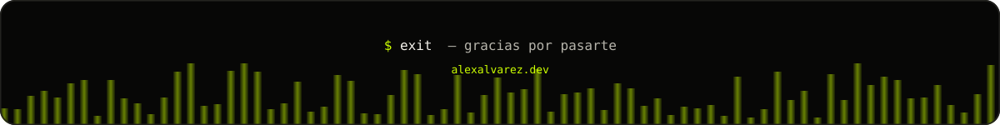

 

 

 

**Construyo producto de punta a punta:** la interfaz, la API, la base de datos, el despliegue y,
cada vez más, la IA que lo hace útil.

Llevo más de cinco años desarrollando aplicaciones web, móviles y de escritorio. De día soy
consultor Full Stack en **Capitole**, trabajando con .NET, Blazor y React para distintos clientes.
El resto del tiempo lo dedico a mis propios productos: SaaS con suscripciones en Stripe, apps con
IA que corre en local, un launcher Android en forma de terminal, herramientas de audio en Rust y
hasta control de iluminación DMX. Me importa que lo que construyo llegue a producción, sea rápido
y se pueda mantener.

## Proyectos destacados

  
  
  
  
  
  

  
    Y además:
    <a href="https://github.com/AlexAlvarezAlmendros/InmoCaptWeb">InmoCaptWeb</a> ·
    <a href="https://github.com/AlexAlvarezAlmendros/ReactOtpWeb">ReactOtpWeb</a> ·
    <a href="https://github.com/AlexAlvarezAlmendros/GoGestiaWeb">GoGestiaWeb</a> ·
    <a href="https://github.com/AlexAlvarezAlmendros/Spufify">Spufify</a> ·
    <a href="https://github.com/AlexAlvarezAlmendros/SelfPortfolio">SelfPortfolio</a>
  

## Stack

<table>
  <tr>
    <td><b>Frontend</b></td>
    <td></td>
  </tr>
  <tr>
    <td><b>Backend</b></td>
    <td></td>
  </tr>
  <tr>
    <td><b>Nativo y escritorio</b></td>
    <td></td>
  </tr>
  <tr>
    <td><b>Datos y cloud</b></td>
    <td></td>
  </tr>
</table>

## Experiencia

**Capitole** · Full Stack Developer · `09/2024 — hoy`  
Consultoría para distintos clientes, en frontend y backend, con .NET, Blazor, React y JavaScript.
Evolutivos en equipos multidisciplinares y resolución de incidencias en producción.

**Bella Aurora Labs** · Full Stack Developer · `05/2024 — 09/2024`  
Aplicaciones internas con Blazor y .NET 8. **Un 40 % más de rendimiento** optimizando código y
migrando a .NET 8, y autenticación segura con JWT.

**Daitec** · Full Stack + microcontroladores · `06/2023 — 05/2024`  
UX/UI y apps multiplataforma con Blazor y MAUI. APIs en C# sobre Azure (IoT Hub, SQL Server,
Blob Storage), microservicios que hablan con microcontroladores y despliegues automatizados con
Azure DevOps.

 

<picture>
  <source media="(prefers-color-scheme: dark)" srcset="https://raw.githubusercontent.com/AlexAlvarezAlmendros/AlexAlvarezAlmendros/output/snake-dark.svg" />
  <source media="(prefers-color-scheme: light)" srcset="https://raw.githubusercontent.com/AlexAlvarezAlmendros/AlexAlvarezAlmendros/output/snake-light.svg" />
  
</picture>

 
 

**¿Tienes un proyecto o una propuesta?** Escríbeme a
[alexalmendrosal@gmail.com](mailto:alexalmendrosal@gmail.com) o por
[LinkedIn](https://www.linkedin.com/in/alexalvarezalmendros).

 

